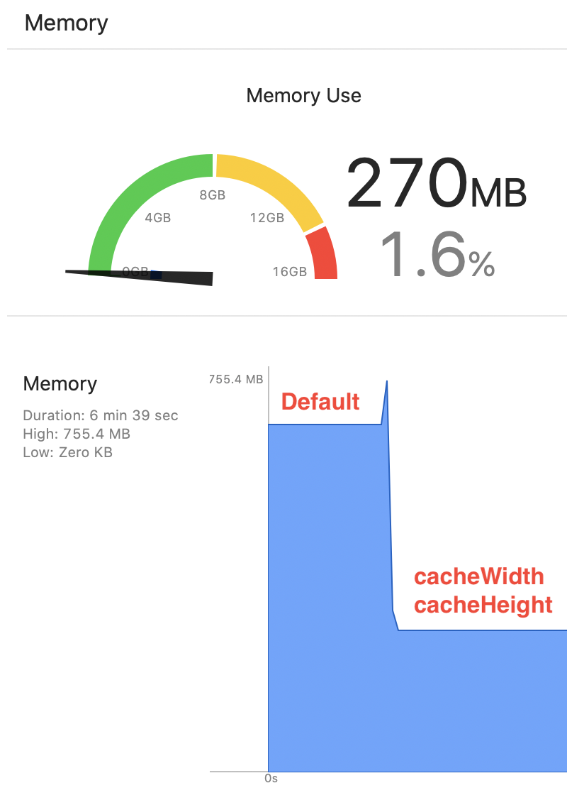

# image_performance

## Memory usage



## Image Quality

Default | Using cacheWidth/cacheHeight
--- | ---
 | 


## Basic usage of cacheWidth/cacheHeight


```dart
LayoutBuilder(
  builder: (context, constraints) {
    final cacheSize =
        (constraints.maxWidth * MediaQuery.of(context).devicePixelRatio)
            .toInt();
    return Image.asset(
      _imageName,
      fit: BoxFit.cover,
      cacheWidth: cacheSize,
      cacheHeight: cacheSize,
    );
  },
);
```